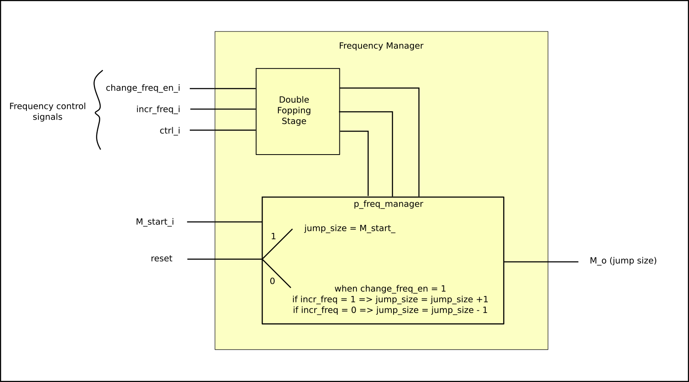
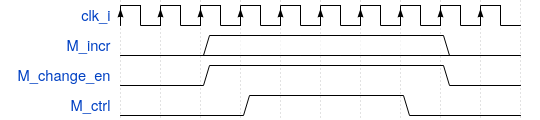

*****************
Frequency Manager
*****************

Instance: *i_frequency_manager_1*, file: *frequency_manager.vhd*

This module takes the frequency change requests in input and change the NCO jump size accordingly.

.. _freq_manager_ink:

   Block diagram for the frequency_manager component

To take into account the clock domain crossing of the change frequency requests (source is the cdr clock while the destination is the system clock), to the enable and increase freuqency signals (which are the signals actually used to know whether to increase or decrease the NCO frequency), a third signal has been added, the control.
As can be seen by :numref:`cdc`, a single requests lasts for a few clock cycles, to make sure they (especially the control signal) stay up for more than two destion clock periods.

.. _cdc:

   Frequency chage requests timing diagram. 
