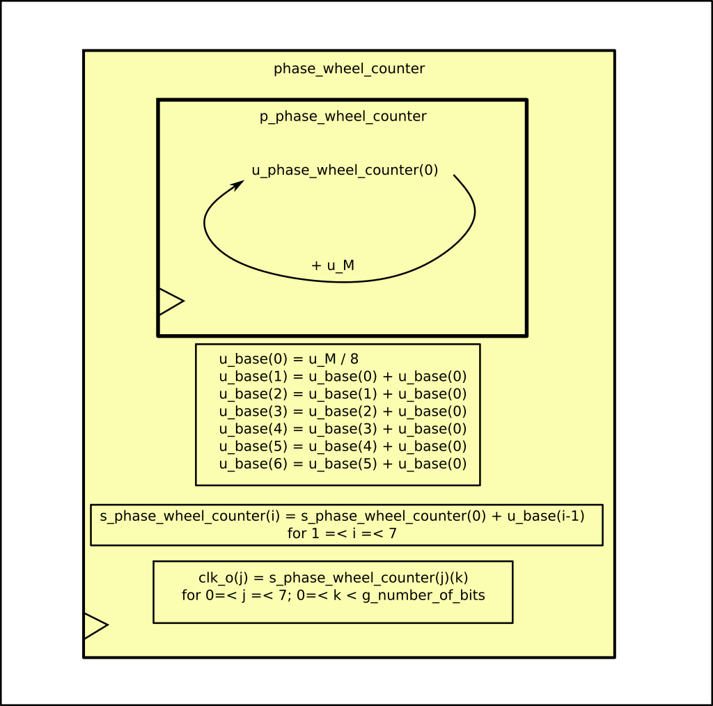
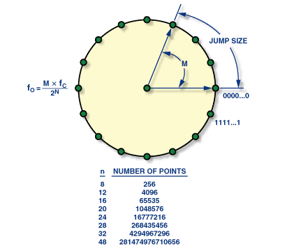
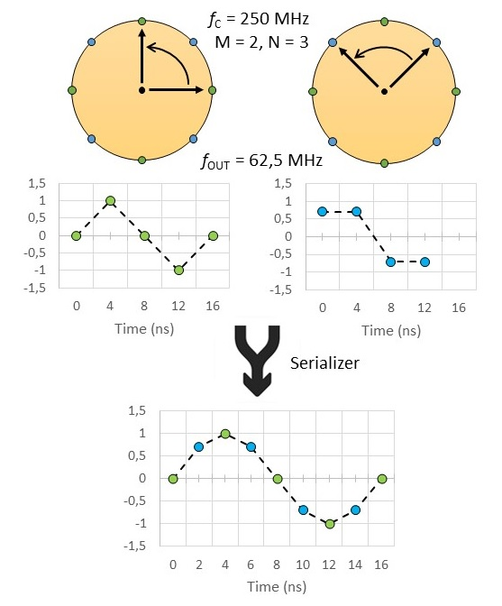

*********************************
Numerically Controlled Oscillator
*********************************

Instance: *i_phase_wheel_counter_1*, file: *phase_wheel_counter.vhd*

.. _phase_wheel_ink:

   Block diagram for the phase_wheel_counter component

The code is actually pretty simple. The phase wheel (:numref:`phase_wheel_example`) is actually a counter (*s_phase_wheel_counter*) which gets incremented by a fixed quantity, the jump size (*u_M*).

.. _phase_wheel_example:

   The phase wheel. The equation on the left shows how to retrieve the out frequency starting from :math:`M`, the jump size, :math:`f_C`, the system clock and :math:`N`, the number of bits used by the vector *s_phase_wheel_counter* (total - bit chosen for the clock)

| To improve the phase resolution, 8 phase wheels counters are generated and each one presents an offset of (jump size)/8 (refer to paper at chapter *The Serdes Technique*), so that, for example, if the jump size is 16, the offset would be 2, and if counter_1 is at 32, counter_2 would equal 34, counter_3 equals 36, counter_4 equals 38 and so on up to counter_8 with the value of 46.
| The next clock clycle counter_1 will be at 48 and the others will still follow the same offset rule

The "LUT" (which is not really a LUT) which generates the clock signal from the counter is represented by the last line. Essentially you just take one bit of the counter, and these will oscillate between 0 and 1 with 50% duty cycle. :numref:`serdes_tec` of the paper shows you an example of why 8 different clocks (2 in the figure) increase the phase resolution. For visual reason the wave in the paper is a sine wave, but the principle is the same with a digital wave.

.. _serdes_tec:

   example of phase resolution improvement by serialing different phase-wheel

In this module a grain and fine clock frequency selection is allowed. The grain selection is carried out during the extraction of the clock from the counter. The LSB oscillate faster than the MSB. The fine selection is performed by the jump_size (*M_i* port) which is what is used to match the NCO clock frequency with the data rate.
