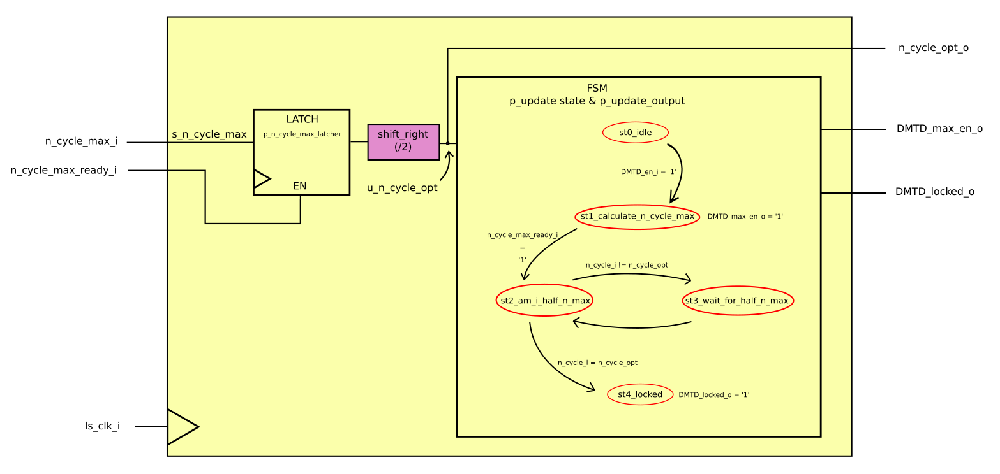

==============
Phase Detector
==============
The Phase Detector (PD) is based on the White Rabbit (WR) Dual Mixer Time Difference (DMTD) phase detector.
For reference go to section 3.5.4 and 4.3.5 of this document_.

.. _document: https://white-rabbit.web.cern.ch/documents/Precise_time_and_frequency_transfer_in_a_White_Rabbit_network.pdf

A description of the functional blocks is following

.. _locker_manager_ref:

locker_manager
==============

   locker_manager block diagram

Before starting to monitor the phase between the clock and the data to match the frequency, an initial condition (lock) must be asserted.

The phase information is retrieved by the n_cycle value (The reader should really give a look to section 3.5.4 of the document_ suggested at the beginning of the PD description) which has a well defined range, finding its maximum value when the clock is aligned with the data edge.

For the :ref:`locker_monitoring_ref` to determine the phase shifts, the the differences of the n_cycle value over time are computed. For these differences to always make sense, we need to take into account possible overflow, which happens when n_cycle increases when on the maximum edge (max -> zero), or decreases when on the minimum edge (zero -> max). In order to have a good range of values to work with, the initial condition is fixed when the n_cycle value is at half of its range. Everything is managed by a Finite State Machine (FSM):

* st0_idle: this is the idle state of the machine. As soon as the module is enabled (DMTD_en_i = '1') then the machine proceeds to the first operative state
* st1_calculate_n_cycle_max: this is the state where the maximum value of the n_cycle range is retrieved. This is easily obtained by feeding to the n_cycle calculator the same clock signal. As a matter of fact, this is exactly what the state does by enabling the DMTD_max_en_o signal.
* st2_am_i_half_n_max: the meaning of this state is very self-explanatory. After the n_cycle maximum value is registered (s_n_cycle_max), its half value is computed (u_n_cycle_opt), and at every rising edge of the clock the state checks whether this value equals the present n_cycle.
* st3_wait_for_half_n_max: another very-hard-to-get state ( :P ). If the previous state didnt find the present n_cycle to be half of the max, it goes into this state and it immediately goes back to state 2 for checking again (I just realized this state is useless, I will remove it when I'll have the chance).
* st4_locked: There it is! the locked condition is met, i.e. the present n_cycle is at half of the maximum value, and the :ref:`locker_monitoring_ref` module have a good range af values to work with. If :ref:`locker_monitoring_ref` determines that the lock is loss, the machine will go back to the idle state and start over.

.. _locker_monitoring_ref:

locker_monitoring
=================

.. figure:: phase_detector/locker_monitoring/locker_monitoring.png
   :scale: 50%

   locker_monitoring block diagram

"locker_monitoring" will detect whether the clock is faster or slower in respect to the data, by monitoring the n_cycle value. It is also responsible to check whether the lock condition is still true (or better, it checks if the loss of lock condition is satisfied).
Basically "locker monitoring" will start monitoring when the rising edge of the "locked" signal is detected (as said `here`__ , this means that the n_cycle is exactly at half of its maximum range). When monitoring, the module will increase or decrease the NCO frequency by its output signals "change_freq_en_o" and "incr_freq_o" based on the following table:

__ locker_manager_ref_

======== ================ ==============
Action   change_freq_en_o incr_freq_en_o
======== ================ ==============
Increase 1                1
Decrease 1                0
======== ================ ==============

The incr/decr condition is met depending on the first derivative of n_cycle: if n_cycle is increasing over time, the the clock is too fast and a decrease pulse should be issued, vice-versa, if n_cycle is decreasing, then the pulse will be an icrease one. Of course, the n_cycle must go under a low-pass filter in order to avoid mis-pulses (due to sampling and clock jitter). Take a look at :ref:`p_phase_shift_counter_ref` to have an idea how the first derivative sign (the algorithm is only sensible to the increasing or decreasing of the phase, it does not gather any information on the "speed" of the shifting) is determined.

All the module presented in the block biagram below will now be explained in details.

p_fix_n_cycle
-------------

This process will determine which is the present n_cycle value (sgn_n_cycle_fixed).

| If a rising edge of the locked condition is detected, the n_cycle is resetted to the optimal value given by the locker_manager (sgn_n_cycle_opt), which is half of the maximum n_cycle range.
| Otherwise, if the nco frequency is changed, i.e. the change_freq_en_o goes to '1', than sgn_n_cycle_fixed increases (or decreases) its present value by sgn_phase_shift, which represents the current n_cycle offset (more details on :ref:`p_phase_shift_counter_ref`).  

The difference between the current n_cycle (sgn_n_cycle_fixed) and the starting n_cycle (n_cycle_opt) is always given by the sgn_n_cycle_diff signal.

.. _p_phase_shift_counter_ref:

p_phase_shift_counter
---------------------

.. figure:: phase_detector/locker_monitoring/p_phase_shift_counter.png
   :scale: 50%

   p_phase_shift_counter process block diagram

| The process is in charge of the phase shifting determination, that means it decides whether the phase has actually moved (forward or backward) one step (phase detector's sensibility) from the previous position (sgn_n_cycle_fixed).
| The idea is to mimic the low-pass filter of a PLL with a simple counter and threshold.

| First of all the process only works when the signal s_monitoring from the :ref:`FSM_ref` = '1', otherwise the counter is resetted.
| When active, the istantaneous phase shift is dynamically monitored (sgn_phase_shift), subtracting the present n_cycle value (sgn_n_cycle_fixed) to the istantanous n_cycle (sgn_n_cycle). Of course this presents an enable signal (sgn_n_cycle_ready) in order to sample the correct n_cycle value.

| The n_cycle counter, when entering a new value, keeps jumping from the old to the new value (and vice-versa) until a semi-stable condition is reached (for example, is n_cycle is increasing, sgn_phase_shift would be something like this ...00001001000101011111..., if decreasing just substitute '1' with '-1').
| The counter should only reach the threshold when the stable condition is met, therefore if sgn_phase_shift = 0 the counter is resetted. This way, only consecutive ones or minus ones are taken into cosideration.

The output of the process is the phase shift counter (sgn_phase_shift_counter) which will be a crucial input to the :ref:`FSM_ref`.

.. _FSM_ref:

FSM
---

.. figure:: phase_detector/locker_monitoring/FSM.png
   :scale: 50%

   FSM block diagram

The FSM (p_update_state and p_update_output processes) manages the frequency of the NCO and the loss of lock control.

As soon as the locker_manager module is locked, the FSM enters the st1_monitoring state. Here the phase shift counter is continuosly monitored to check whether it goes above threshold or beyond (- threshold). Depending on which of these two conditions are satisfied, the next state will be st2a_incr or st2b_decr, which will change the NCO frequency.

| When the FSM find itself in the incr/decr state, an "if" condition monitors the loss of lock: if the current n_cycle (n_cycle_fixed) is very close to the edge of the n_cycle range, than the lock is lost (the reader should remember that the lock condition starts at the middle of the range, so to get to the edge means that the NCO frequency is really not that close to the data frequency).
| Also, if the istantaneous n_cycle (sgn_n_cycle) differs from the current n_cycle (again, sgn_n_cycle_fixed) of user-decided units (something like 3), than there is loss of lock. This condition is needed to avoid funny behaviour when the clock frequency is very different and n_cycle changes several time while the counter is reaching the threshold.
