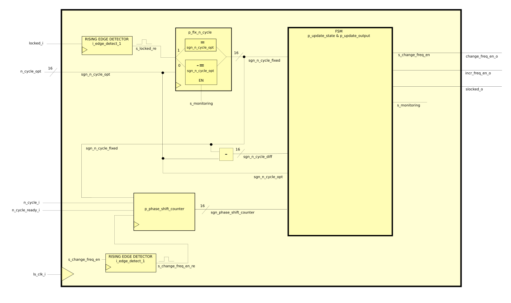

==============
Phase Detector
==============
The PD is based on the White Rabbit (WR) Dual Mixer Time Difference (DMTD) phase detector.
For reference go to section 3.5.4 and 4.3.5 of document "https://white-rabbit.web.cern.ch/documents/Precise_time_and_frequency_transfer_in_a_White_Rabbit_network.pdf"

A description of the functional blocks is following

locker_monitoring
=================

   locker_monitoring block diagram

"locker_monitoring" module will detect whether the clock is faster or slower in respect to the data. It is also responsible to check whether the lock condition is still true (or better, it checks if the loss of lock condition is satisfied).
Basically "locker monitoring" will start monitoring when the rising edge of the "locked" signal is detected (as said, this means that the n_cycle is exactly at half of its maximum range). When monitoring, the module will increase or decrease the NCO frequency by its output signals "change_freq_en_o" and "incr_freq_o" based on the following table:

======== ================ ==============
Action   change_freq_en_o incr_freq_en_o
======== ================ ==============
Increase 1                1
Decrease 1                0
======== ================ ==============

The incr/decr condition is met depending on the first derivative of n_cycle: if n_cycle is increasing over time, the the clock is too fast and a decrease pulse should be issued, vice-versa, if n_cycle is decreasing, then the pulse will be an icrease one. Of course, the n_cycle must go under a low-pass filter in order to avoid mis-pulses (due to sampling and clock jitter).

All the module presented in the block biagram below will now be explained in details.

p_fix_n_cycle
-------------

This process will determine which is the present n_cycle value (sgn_n_cycle_fixed).

| If a rising edge of the locked condition is detected, the n_cycle is resetted to the optimal value given by the locker_manager (sgn_n_cycle_opt), which is half of the maximum n_cycle range.
| Otherwise, if the nco frequency is changed, i.e. the change_freq_en_o goes to '1', than sgn_n_cycle_fixed increases (or decreases) its present value by sgn_phase_shift, which represents the current n_cycle offset (more details on p_phase_shift_counter section).  

The difference between the current n_cycle (sgn_n_cycle_fixed) and the starting n_cycle (n_cycle_opt) is always given by the sgn_n_cycle_diff signal.
