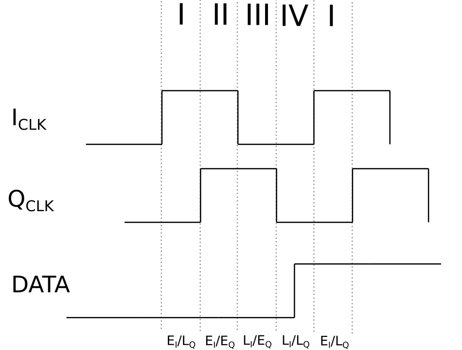
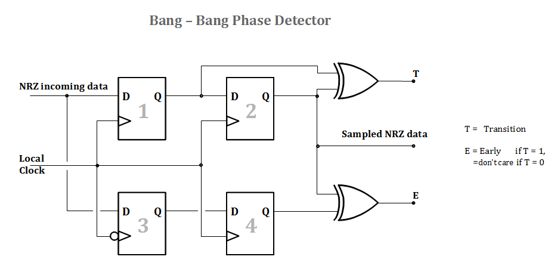

==========================
Phase (Frequency) Detector
==========================

To mimic the PLL architecture for the CDR, a phase/frequency detector is needed, in order to compare the NCO output clock frequency to the data rate.

To detect a frequency difference, the transition of the data signal shall be compared with the transition of two clocks of equal frequency that have a constant phase difference.

Denoting with :math:`f_d` the data frequency and with :math:`f_{VCO}` the clock frequency, we have that:

:math:`f_d = (\phi_d(t_1) - \phi_d(t_0)) / (t_1 - t_0)`

:math:`f_{VCO} = (\phi_{VCO}(t_1) - \phi_{VCO}(t_0)) / (t_1 - t_0)` 

| where :math:`\phi_d(t)` and :math:`\phi_{VCO}(t)` represents the data and clock phase respectively at the time :math:`t`.
| Let's keep in mind that the time :math:`t_1` and :math:`t_0` are given by the NCO clock, as the only time based signal.

The frequency difference is then given by:

:math:`f_d - f_{VCO} = [(\phi_d(t_1) - \phi_{VCO}(t_1)) - (\phi_d(t_0) - \phi_{VCO}(t_0))] / (t_1 - t_0)`

| The two phase differences in the numerator at the righ hand side of the equation are the output of the phase detector, comparing the data transition with the NCO clock transition at the instances :math:`t_1` and :math:`t_0`.
| These phase differences will vary with time (in case of frequency offset), making a frequency difference detection possible.

Practical implementation
========================
| By using two clocks with 50% duty cycle and orthogonal with each-other (:math:`\pi / 2` of phase difference), it is possible to divide the entire 360 degrees clock period into four quandrants, as shown in :numref:`quadrants` .
| The two phase detector (one for each clock) indicate the quandrants where the data signal transition is located, updating this information at every new data edge.

If the data phase is shifting with respect to the clock edges, than the clock quadrant that detects the data transition will increase or decrease, accordingly to the phase shifting direction. 

In the implemented design, the frequency detection capability relies on the use of two clock signals, with 50% duty cycle and orthoghonal with each-other. These two signals allows the division of a clock period into four quadrants (see :numref:`quadrants`).

To identify the quadrant of the data edges, informations by two Alexander-type phase detectors (:numref:`bbpd`) are registered and processed. Further processing is needed to determine whether the data edges are drifting up or down in the clock quandrants (due to higher or lower clock frequency) to consistenly adjust the NCO frequency. These frequency change requests to the NCO are constantly monitored in order to control CDR locked flag.

Informations on the phase and frequency detection techniques whose this design is based from, can be found here [2]_.

.. The implementation of such a kind of phase detector is still under evaluation. One possible solution is to use two Alexander type Bang-Bang phase detectors (:numref:`bbpd`), and adjust the NCO frequency at every quadrant transition.

.. _quadrants:

   The division of the clock period in four equal qudrants (indicated by the Roman numerals). :math:`I_{CLK}` stands for In-phase Clock, which is the reference, :math:`Q_{CLK}` stands for Quadrature Clock, which idetifies the :math:`+ \pi / 2` (or :math:`- \pi /2`) phase difference  clock. To idetify a quandrant, an Early (E) and Late (L) notation (Clk vs Data) is used. If a data transition is first located in quadrant III and then in quadrant II, the data phase is shifting to the left, which equals that the data transitions are based on a clock faster than the NCO clock.

.. The implementation of such a kind of phase detector is still under evaluation. One possible solution is to use two Alexander type Bang-Bang phase detector (:numref:`bbpd`), one working with the reference clock, the other with the :math:`\pi / 2` phase offset, to idetify the quadrants, and adjust the NCO frequency at every quadrant transition.

.. _bbpd:

   The bang-bang PD compares the negative edge of the clock with the data transition, and the present data bit with the previous data bit. Using 4 flip flops the resulting info is contemporarily available for one entire clock period. The output T is active when a data transition is detected, the output E is active when the clock has been found early.

.. [2] https://en.wikibooks.org/wiki/Clock_and_Data_Recovery
