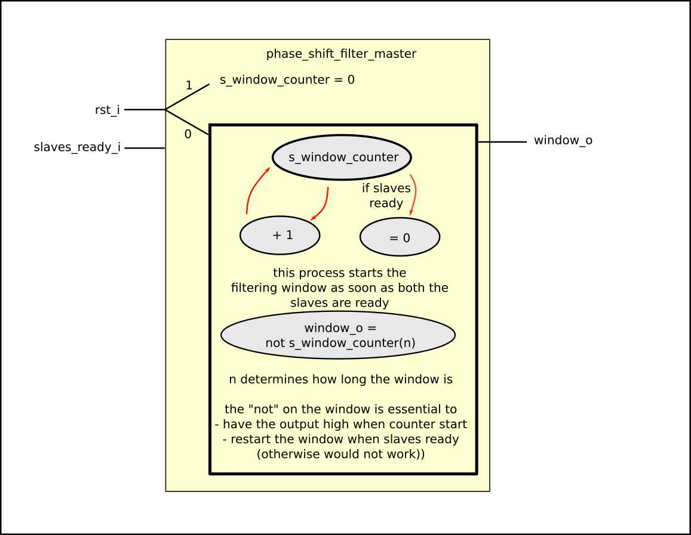
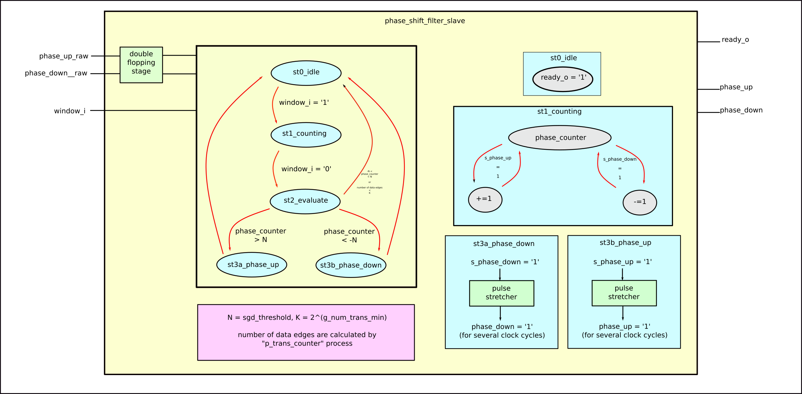

****************************
Phase and Frequency Detector
****************************

Instance: *i_pfd_1*, file: *pfd.vhd*

In this section we are going to analyze the vhd files used to compare the NCO clock frequency with the data rate.

As explained in the documentation, the frequency matching is basen on dividing the whole clock period in 4 quadrants, and monitoring in which quandrant the data present its edges. If the quadrant of the data edges changes onver time, the clock frequency does not match the data rate. In particular if the data edges quadrant is shifting up, the NCO clock is faster, while if the data edges are costantly moving towards a lower quandrants, the NCO clock frequency is slower.

The quadrant detection capability relies on the use of two Alexander type bang bang phase detector (:numref:`bbpd_2`), one working with a so-called "in-phase clk" (clk_i_i) and the other with a "quadrature clock" (clk_q_i), featuring a pi/2 phase difference.

.. _bbpd_2:
.. figure:: frequency_detector/BBPD.png
   :width: 80%
   :align: center

   Alexander-type Bang-Bang phase detector

The Early/Late signals of the phase detectors are filtered by the *phase_shift_filter* Master/Slave couple modules. The filtering is explained in the dedicated section.

The filtered Early/Late signals are monitoried by the *quadrant_detector* module which dinamically determines the current quadrant of the data edges. The shifting of quadrants is given by the *quadrant_shifting_detector* module.

Phase Shift Filter
##################

Instance: *i_phase_shift_filter_slave_1, i_phase_shift_filter_slave_2*, file: *phase_shift_filter_slave.vhd*
Instance: *i_phase_shift_filter_master_1*, file: *phase_shift_filter_master.vhd*

The *phase_shift_filter_master/slave* are components used to filter the raw up/down data-to-clock phase by the phase detectors in order to get rid of possible errors caused by jitter and bad sampling due to flip-flop setup/hold violations.

| The mechanism of the filtering is very trivial: the master gives the slaves a user-defined time window in which the slaves counts the raw phase up or down flags. When the master window goes to 0, the slaves look at their counter and, based on a defined threshold, decide whether te data-to-clock phase is actually up or down.
| Regarding the master, the length of the filtering window is :math:`2^{g\_num\_trans}`. Concerning the slaves, the minimum data transition in order to take a decision is :math:`2^{g\_num\_trans\_min}`, while the threshold for the counter to take a decision is half of the registered number of data transitions.

The phase_up/down output is stretched for a configured number of steps (usually 3) for Clock Domain Crossing (CDC) reasons.

In order fo the slaves to take a decision, a minimum of data edges must be present (data must be AC balanced).

.. _master_filter:

   Block diagram for the phase_shift_filter_master

.. _slave_filter:

   Block diagram for the phase_shift_filter_slave

Quadrant Detector
#################

Instance: *i_quadrant_detector_1*, file: *quadrant_detector.vhd*
Instance: *i_quadrant_shifter_detector_1*, file: *quadrant_shifting_detector.vhd*

The *quadrant_detector* module detects in which clock quadrant the data has its edges. To do so, it processes the informations passed on by the *phase_shift_filter_slave* modules.

The quadrant information is ten used by the *quadrant_shifting_detector* module in order to monitor the shifting of the data edges quadrant to dictate whether the clock frequency is faster or slower than the data rate.

To understand how the quadrants are identified, please refer to :numref:`quad`

.. _quad:
.. figure:: quadrant_thing/quadrants.png
   :width: 50%
   :align: center

   Quadrants definitions based on early/late data-to-clock phase.

The concept behind how the modules work is not really difficult. Please look at the source VHDL code and look at the following figures for an easier comprehension.

.. _quadrant_detector:
.. figure:: quadrant_thing/quadrant_detector_ink.png
   :width: 70%
   :align: center

   Block diagram for the quadrant_detector

.. _quadrant_shifting:
.. figure:: quadrant_thing/quadrant_shifting_detector_ink.png
   :width: 100%
   :align: center

   Block diagram for the quadrant_shifting_detector

To avoid any mis-shifting-detection going from the idle state to the next states, the *quadrant_shifting_detector* module presents a set-reset flip-flop which enables the shifting identification only when at least one quadrant was already identified.

The *locked_o* port of the *quadrant_shifter_detector* module can be though as a primordial CDR lock flag, but in the code this is actually not used and the locked flag comes from the *lock_manager* module.
